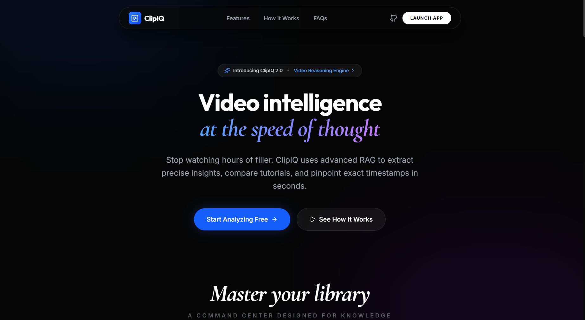

# ClipIQ: YouTube Intelligence Engine

<p align="center"><strong>RAG-powered video understanding with timestamp-grounded Q&A, dual-video comparison, and production-ready UX.</strong></p>

<p align="center">
  
  
  
  
  
  
  
  
  
  
  
</p>

<p align="center">
  
</p>
<p align="center"><em>Landing page visual placeholder (asset from <code>frontend/public</code>)</em></p>

## What ClipIQ Does
ClipIQ transforms long YouTube videos into verifiable intelligence:
- executive summaries with key takeaways
- evidence-grounded chat answers
- clickable timestamps for instant seek
- dual-video analysis with scoped reasoning (Video A / Video B / both)
- history restore for continued sessions

## Key Capabilities
### Single-video intelligence
- URL ingestion with transcript + metadata extraction
- adaptive chunking and vector indexing
- chat mode with grounded answers and timestamp sources
- summary generation with starter prompts

### Dual-video intelligence
- side-by-side contrast map
- scope-aware chat routing for A-only, B-only, or both
- common-theme and comparative question handling
- optional study-mode workflow

### Retrieval and grounding quality
- hybrid retrieval (self-query, dense, lexical, temporal expansion)
- timestamp alignment and chip-safe emission rules
- fallback handling for unsupported / out-of-scope queries
- transcript ingestion fallbacks for robust caption retrieval paths

### Product UX
- responsive desktop + mobile layouts
- smooth scrolling and route sync
- global toast alerts for system feedback
- paginated history views and session restore

## System Architecture
```text
User Input (URL / Question)
  -> FastAPI Route Layer
  -> RAG Pipeline (single or dual)
  -> Transcript + Metadata + Chunking
  -> Embeddings + Chroma persistent index
  -> Hybrid Retrieval + Ranking + Grounding
  -> LLM Response Policy + Formatting
  -> Frontend Chat/Summary UI + Timestamp Seek
```

## Repository Structure
```text
YoutubeRAGSystem/
  backend/
    app/
      config.py
      schemas.py
      routes/
        video.py
      rag/
        pipeline.py                # single-video orchestration
        multi_video_pipeline.py    # dual-video orchestration
        compare_service.py         # compare service wiring
        transcript.py              # transcript + metadata ingestion
        retriever.py               # Chroma + retriever builders
        retrieval_helpers.py       # ranking/timestamp helper utilities
        policy_helpers.py          # route/policy classification helpers
        embeddings.py              # safe embedding wrapper + sanitization
    main.py
    requirements.txt
    .env.example
  frontend/
    public/
      ytlogo.svg
    src/
      components/
      pages/
      lib/
      App.tsx
      main.tsx
      index.css
    package.json
    .env.example
  notebooks/
  README.md
```

## Backend RAG Modules
- `pipeline.py`: single-video processing, chat, summary, cleanup
- `multi_video_pipeline.py`: dual-video retrieval, scope routing, compare chat generation
- `transcript.py`: video ID parsing, metadata fetch, transcript extraction/fallback, chunk prep
- `retriever.py`: Chroma vectorstore create/load/delete + self-query retriever wiring
- `retrieval_helpers.py`: hybrid ranking, timestamp extraction/alignment, lexical fallback
- `policy_helpers.py`: response policy classification (`CHAT`, `RAG`, `SUMMARY`)
- `embeddings.py`: embedding safety layer, input sanitization, retry robustness

## API Surface
- `GET /`: root health message
- `GET /api/health`: API health check
- `POST /api/process`: process single video
- `POST /api/chat`: single-video chat
- `POST /api/summary`: single-video summary
- `POST /api/compare`: dual-video compare/chat
- `POST /api/check-technical`: study suitability check
- `POST /api/cleanup`: remove session + persisted artifacts

## Quick Start
### Prerequisites
- Python `3.11.x`
- Node.js `18+`
- Ollama available locally for embedding model usage
- OpenRouter and Google API keys

### Backend setup
```bash
cd backend
python -m venv venv
venv\Scripts\activate
pip install -r requirements.txt
uvicorn main:app --reload --port 8000
```

### Frontend setup
```bash
cd frontend
npm install
npm run dev
```

Open `http://localhost:3000`.

## Environment Variables
Place values in `backend/.env`:

- `OPENROUTER_API_KEY`: OpenRouter key for response generation
- `OPENROUTER_MODEL`: model identifier used by backend
- `GOOGLE_API_KEY`: YouTube Data API key for metadata
- `HUGGINGFACEHUB_API_TOKEN`: optional alternative model token
- `OLLAMA_EMBEDDING_MODEL`: local embedding model name (default `bge-m3`)
- `FRONTEND_ORIGIN`: CORS origin for frontend
- `CHROMA_PERSIST_DIR`: optional custom Chroma persistence path

## Troubleshooting
### Transcript appears available but processing fails
- Check backend logs for network restrictions to YouTube endpoints.
- On Windows, `WinError 10013` indicates firewall/proxy/socket blocking.
- Run cleanup and reprocess the video after network access is restored.

### Chroma telemetry warnings
- Telemetry is disabled in config/retriever paths.
- If warnings persist in stale envs, reinstall with pinned requirements and restart backend.

### Dependency validation
```bash
pip check
python -m py_compile app/rag/pipeline.py app/rag/multi_video_pipeline.py app/rag/transcript.py
```

## Development Notes
- Session state is kept in-memory by `session_id`.
- Vector indexes persist in backend `.chroma_db`.
- Cleanup endpoint supports deleting both session cache and persisted indexes.

## Roadmap
- streaming responses for better perceived latency
- regression evaluation set for timestamp accuracy
- telemetry for retrieval quality and latency diagnostics
- optional external session store (Redis/DB)

## Repository
https://github.com/XynaxDev/youtube-rag-system

<p align="center">
  Built with focused iteration on retrieval quality, grounding accuracy, and UX clarity.<br/>
  UI collaboration credit: <strong>Shakshi</strong>.
</p>
